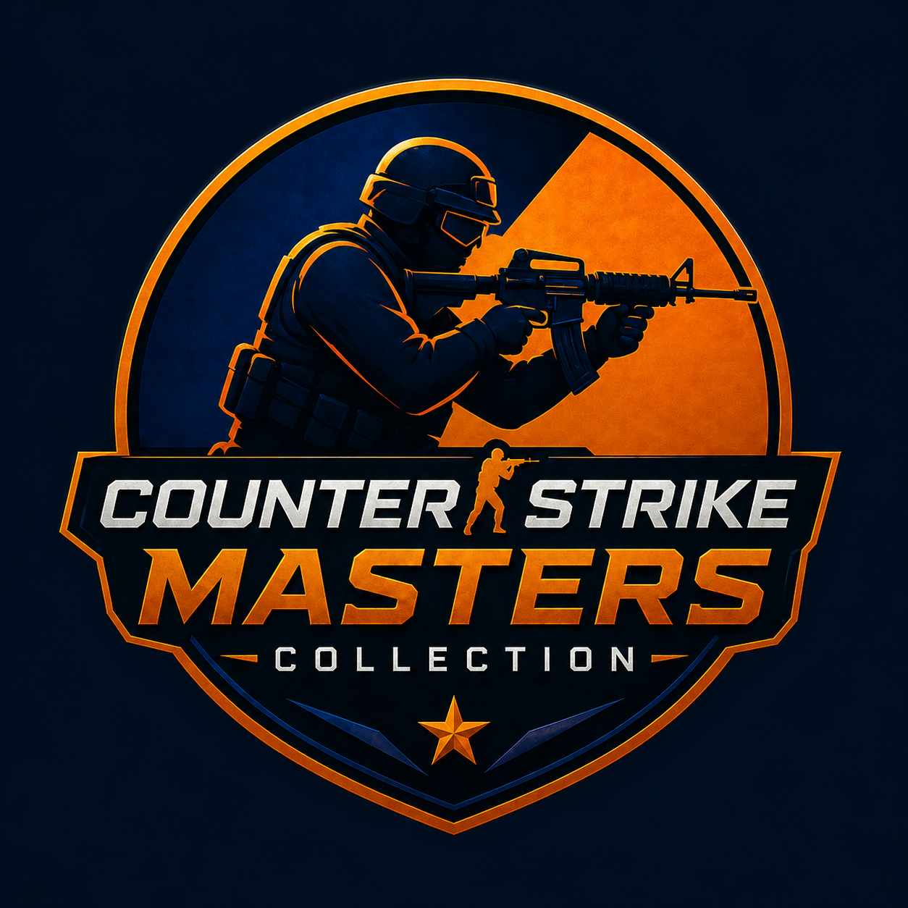

# Counter-Strike Masters Collection

<p align="center">
  
</p>

<p align="center">
  <strong>A lightweight Windows launcher for a curated collection of Counter-Strike classics and community mods.</strong>
</p>

<p align="center">
  <a href="https://github.com/AniketSpecter/Counter-Strike-Master-Collection/releases/latest"><strong>Download latest release</strong></a>
  · <a href="https://github.com/AniketSpecter/Counter-Strike-Master-Collection/issues/new/choose">Report a problem</a>
  · <a href="https://github.com/AniketSpecter/Counter-Strike-Master-Collection/discussions">Discussions</a>
  · <a href="https://discord.gg/cGxs3jTf3e">Discord</a>
</p>

## Download

The current public release is **CS Masters Collection v1.0.4** for 64-bit Windows.

[Download CS Masters Collection v1.0.4](https://github.com/AniketSpecter/Counter-Strike-Master-Collection/releases/latest)

The launcher is approximately 110 MiB. Games are not bundled with it; users choose which titles to download and install from inside the launcher.

### Release verification

The v1.0.4 Windows installer SHA-256 is:

```text
C79DD16D2FD5F508C7613CA30FB38B4098C4A2A28764E26FD50ECD4BE01BFC7A
```

GitHub also displays a digest beside the installer asset. Windows SmartScreen may warn about this community release because the installer is not currently code-signed.

## Launcher highlights

- Browse the full collection without storing every game locally.
- Install games on demand from Google Drive or MEGA without signing in.
- Pause, resume, cancel, and recover interrupted downloads.
- View percentage, transferred bytes, speed, and estimated remaining time.
- Automatically verify and extract game archives.
- Play, repair, move, locate, open, or uninstall installed games.
- Select a custom game executable or launcher when needed.
- Manage multiple game libraries and download-cache locations.
- Use ten themes, server browsing, playtime tracking, notifications, and community links.

## Screenshot


## Help and feedback

- Use [Bug reports](https://github.com/AniketSpecter/Counter-Strike-Master-Collection/issues/new?template=bug_report.yml) for reproducible launcher problems.
- Use [Feature requests](https://github.com/AniketSpecter/Counter-Strike-Master-Collection/issues/new?template=feature_request.yml) for suggestions.
- Use [Discussions](https://github.com/AniketSpecter/Counter-Strike-Master-Collection/discussions) for general questions and community conversation.
- Join the [Discord community](https://discord.gg/cGxs3jTf3e) for community help and contact.
- Watch [Ultimate Gaming Zone](https://www.youtube.com/@ugz9) and the [Valve Games Evolution playlist](https://youtube.com/playlist?list=PLHhmrXeOoWFH4GowGkriRZbEttF7JqbXX).

Before reporting a download or installation problem, include the launcher version, game name, install path, exact error message, and a screenshot with private information removed.

## Public repository policy

This is the public distribution and community repository. It intentionally contains release downloads, documentation, screenshots, roadmap information, changelogs, Issues, and Discussions—not launcher source code or game archives.

Counter-Strike, GoldSrc, Steam, and related trademarks and game content belong to Valve Corporation and their respective owners. This community project is not affiliated with or endorsed by Valve.
