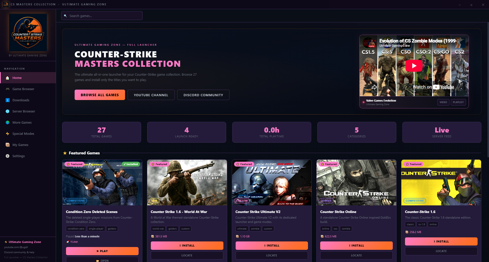

# CS Masters Collection — User Guide

> **Version:** 1.0.6 · **Platform:** Windows 10 / 11 (32-bit & 64-bit)

<p align="center">
  
</p>

---

## Table of Contents

1. [Installation](#1-installation)
2. [First Launch — Setup Wizard](#2-first-launch--setup-wizard)
3. [Home Page](#3-home-page)
4. [Game Library (Game Browser)](#4-game-library--game-browser)
5. [Game Cards — Every Button Explained](#5-game-cards--every-button-explained)
6. [Downloads Page](#6-downloads-page)
7. [My Games](#7-my-games)
8. [Server Browser](#8-server-browser)
9. [Special Modes](#9-special-modes)
10. [Settings](#10-settings)
11. [Counter-Strike WW2 — Mode Picker](#11-counter-strike-ww2--mode-picker)
12. [Half-Life — Installer Flow](#12-half-life--installer-flow)
13. [Themes](#13-themes)
14. [Troubleshooting](#14-troubleshooting)

---

## 1. Installation

1. Download the correct installer from the [latest release](https://github.com/AniketSpecter/Counter-Strike-Master-Collection/releases/latest):
   - **64-bit** — for most modern PCs running Windows 10 or 11
   - **32-bit** — for older hardware running a 32-bit edition of Windows 10

2. Run the installer. **No administrator rights are required** — the launcher installs into your user profile by default (`%LOCALAPPDATA%\Programs\CS Masters Collection`).

3. If Windows SmartScreen shows *"Windows protected your PC"*, click **More info** then **Run anyway**. The launcher is safe but not yet code-signed.

4. Follow the NSIS setup wizard (choose install folder if desired → Install → Finish).

5. A desktop shortcut and Start Menu entry are created automatically.

---

## 2. First Launch — Setup Wizard

On first launch a **Setup Wizard** guides you through two choices:

### Game Library Location
Where installed games will be stored. The default is:
```
C:\Users\<you>\AppData\Local\CSMC
```
You can set any folder on any drive — an external drive or a secondary HDD works well given the game sizes.

### Download Cache Location
Where `.7z` archives are kept during download. Once a game is installed the archive is deleted to save space. Defaults to the same parent as the Game Library.

> **Tip:** Both paths can be changed later in **Settings → Library**.

Click **Finish** after confirming your choices. The launcher loads the full game catalog immediately.

---

## 3. Home Page

The Home page is the first screen after setup. It has four areas:

### Hero Banner
Displays the collection title and three quick-access buttons:
| Button | Action |
|--------|--------|
| **Browse All Games** | Jumps directly to the Game Browser |
| **YouTube Channel** | Opens Ultimate Gaming Zone on YouTube |
| **Discord Community** | Opens the Discord invite link |

A **Valve Games Evolution** video mini-player sits in the top-right corner. Click the play button to watch the CS history playlist without leaving the launcher.

### Stats Bar
Five live counters across the center of the page:

| Stat | Meaning |
|------|---------|
| **Total Games** | Number of games in the catalog |
| **Launch Ready** | Games installed and ready to play right now |
| **Total Playtime** | Cumulative hours played across all games |
| **Categories** | Number of game categories in the library |
| **Server Feed** | Live / Offline status of the community server list |

### Featured Games
A horizontal row of highlighted game cards. Each card shows the game image, category badge, size, and action buttons. Scroll right to see all featured titles.

### Navigation Sidebar (left panel)
| Item | Description |
|------|-------------|
| 🏠 **Home** | Returns to this page |
| 🎮 **Game Browser** | Full searchable and filterable game library |
| ⬇️ **Downloads** | Active and completed download queue |
| 🌐 **Server Browser** | Live CS server list |
| ➕ **More Games** | Additional titles and expansions |
| ⚡ **Special Modes** | Zombie, WW2, and other special-mode games |
| 🗂️ **My Games** | Only your installed games |
| ⚙️ **Settings** | All launcher preferences |

At the bottom of the sidebar you'll find links to YouTube, Discord, and the current launcher version.

---

## 4. Game Library / Game Browser

Click **Game Browser** in the sidebar to see all 27 games in the catalog.

### Search
Type in the **Search games…** bar at the top to filter by name in real time.

### Category Filter
Click a category badge to show only games of that type:
- **Competitive** — classic CS editions
- **Zombie** — zombie-mode mods
- **Custom** — heavily modified standalone builds
- **Fun** — themed or novelty editions
- **WW2** — World War 2 themed titles

### Sort / View
Use the sort controls to order by name, size, or era. Switch between grid and list views using the view toggle.

---

## 5. Game Cards — Every Button Explained

Each game is displayed as a card. The buttons change depending on whether the game is installed.

### Not Installed

| Button | Action |
|--------|--------|
| **I INSTALL** | Starts the download and installation process |
| **LOCATE** | Manually point to an existing installation on your PC |

### Installed

| Button | Action |
|--------|--------|
| **▶ PLAY** | Launches the game immediately |
| **OPEN** | Opens the game's installation folder in File Explorer |

### Three-Dot Menu (⋯) — Right-click or click ⋯
Right-click any installed game card **or** click the three-dot button (top-right of the card) to open the context menu:

| Menu Item | Description |
|-----------|-------------|
| 🎯 Change Launch .exe | Choose a different executable to launch (e.g. a custom launcher inside the game folder) |
| 🔧 Repair Installation | Re-downloads and re-extracts the game archive to fix corrupted files |
| 📦 Move Installation | Moves the game folder to a different drive or location |
| 🖥️ Create Desktop Shortcut | Adds a shortcut directly to your Desktop |
| 📌 Add to Start Menu | Pins the game to your Windows Start Menu |
| 🔄 Re-detect Image | Rescans the game folder and updates the card thumbnail |
| 🗑️ Uninstall | Permanently deletes the game folder from your PC |

### Download Progress
While a game is downloading, the card shows:
- A **progress bar** with percentage
- **Speed** (MB/s)
- **Transferred / Total** bytes
- **ETA** (estimated time remaining)
- **Pause**, **Resume**, and **Cancel** buttons

---

## 6. Downloads Page

Click **Downloads** in the sidebar to see all download activity.

### Queue States
| State | Meaning |
|-------|---------|
| **Downloading** | File is actively being fetched |
| **Paused** | Download is paused — click Resume to continue |
| **Verifying** | Checking the downloaded archive's integrity |
| **Extracting** | Unpacking the game archive to the library folder |
| **Complete** | Installation finished successfully |
| **Error** | Something went wrong — an error message is shown |
| **Cancelled** | You cancelled the download |

### Controls
- **Pause / Resume** — suspend and continue without losing progress; partial downloads are saved to disk
- **Cancel** — stops the download and removes the partial file
- Closing the launcher while downloading is safe — downloads **resume automatically** next launch

### Download Sources
Games are hosted on **Google Drive** or **MEGA**. No account or sign-in is needed for either service.

---

## 7. My Games

Click **My Games** to see only the games currently installed on your PC. This is the fastest way to access your playable collection without scrolling the full catalog.

You can also add games that you already have installed elsewhere (not downloaded through the launcher):
1. Find the game in the Game Browser
2. Click **LOCATE**
3. Browse to the game's root folder and confirm

The launcher registers it, detects the correct executable, and shows a **PLAY** button immediately.

---

## 8. Server Browser

Click **Server Browser** to view live Counter-Strike servers from the community feed.

| Column | Meaning |
|--------|---------|
| **Name** | Server name |
| **Map** | Currently active map |
| **Players** | Connected / Max players |
| **Ping** | Latency in milliseconds |
| **Game** | Which CS variant |

Click any row then **Connect** to launch the matching game and join directly. If the game is not installed you will be prompted to install it first.

---

## 9. Special Modes

Click **Special Modes** to filter the catalog to zombie, WW2, and other special-mode entries — useful if you specifically want to browse non-standard gameplay experiences.

---

## 10. Settings

Click **Settings** in the sidebar to configure the launcher.

### Library
| Option | Description |
|--------|-------------|
| **Game Library Path** | Root folder where all games are installed. Click **Change** to relocate. |
| **Download Cache Path** | Where `.7z` archives are stored during download. |
| **Add Library** | Register an additional library location (multiple drives supported) |

### Detection
| Option | Description |
|--------|-------------|
| **Scan Steam / Valve** | Scans `C:\Program Files (x86)\Steam\steamapps\common` and other Steam library paths detected from the registry. Any found Valve games (HL, CS, CZ, etc.) are auto-registered in the launcher. |
| **Add External Game** | Manually register any game folder that isn't in the catalog |

### Runtimes
The launcher checks for required Visual C++ Redistributables, DirectX Jun 2010, and .NET 4.8 at startup. In **Settings → Runtimes** you can:
- See which runtimes are installed
- Manually trigger installation of any missing runtime
- Opt out of the automatic runtime reminder

> These runtimes are required by GoldSrc engine games (CS 1.6, HL, CZ, etc.). They are downloaded directly from Microsoft — no bundled installers.

### Preferences
| Option | Description |
|--------|-------------|
| **Theme** | Choose from 10 built-in themes (see [Themes](#13-themes)) |
| **Minimize to Tray** | Keep the launcher running in the system tray when closed |
| **Launch on Startup** | Start the launcher with Windows |
| **Show Playtime** | Toggle playtime tracking and display |
| **Check for Updates** | Launcher checks GitHub for new versions on startup |
| **Patch Notes** | View the built-in changelog for all versions |

### About
Displays the current launcher version, build date, and links to the GitHub repository.

---

## 11. Counter-Strike WW2 — Mode Picker

Counter-Strike WW2 has a special **in-launcher mode picker** that appears every time you press **PLAY**. You do not need to use the original `CS-Launcher.bat` at all.

### Game Modes
| Mode | Description |
|------|-------------|
| **Normal** | Standard Counter-Strike gameplay |
| **Team Death Match** | Respawn-based team deathmatch |
| **Nazi Zombies** | Zombie survival mode |
| **Dogfight Mode** | Air combat variant |
| **Nazi Zombie: Escape** | Zombie escape scenario |

### Graphics Quality
| Setting | Effect |
|---------|--------|
| **Normal** | Standard graphics — recommended for lower-end PCs |
| **High** | Enhanced rendering — recommended for modern hardware |

Click the mode and graphics buttons to select your choices. The **preview bar** at the bottom shows your current selection. Click **🚀 Launch Game** to apply the settings and start the game.

> Under the hood the launcher swaps the correct `plugins-*.ini` configuration files and `setting.cfg` inside the game folder — exactly what the original batch file does — without opening any command window.

---

## 12. Half-Life — Installer Flow

Half-Life uses the official Valve installer (not a `.7z` archive).

1. Click **I INSTALL** on the Half-Life card
2. The launcher downloads the installer `.exe` from Google Drive
3. When the download completes, the **installer launches automatically**
4. Follow the Half-Life setup wizard to choose your install folder
5. After the wizard finishes, return to the launcher
6. Click **LOCATE** on the Half-Life card
7. Browse to the folder you chose in the wizard (e.g. `C:\Sierra\Half-Life`)
8. Confirm — the launcher registers the installation and shows **▶ PLAY**

---

## 13. Themes

The launcher includes **10 built-in themes**. Change theme in **Settings → Preferences → Theme**.

| Theme | Style |
|-------|-------|
| Default Dark | Dark charcoal with orange accents |
| Cyberpunk | Neon yellow-green on deep black |
| Anime Neon | Pink and purple neon glow |
| Military Green | Tactical olive-green palette |
| Blood Red | Dark crimson for zombie mode fans |
| Ocean Blue | Deep navy and cyan |
| Sunset Orange | Warm amber gradient |
| Monochrome | Greyscale minimal design |
| Gold Edition | Luxurious black and gold |
| Classic CS | Counter-Strike 1.6 inspired palette |

Themes apply instantly with no restart required.

---

## 14. Troubleshooting

### Windows SmartScreen blocks the installer
Click **More info** → **Run anyway**. The launcher is not yet code-signed but is safe. Verify the SHA-256 hash shown on the [release page](https://github.com/AniketSpecter/Counter-Strike-Master-Collection/releases/latest) matches the file you downloaded.

### Game crashes immediately after launching
The game likely needs Visual C++ Redistributables or DirectX. Go to **Settings → Runtimes** and install any missing items listed there.

### Download fails or stalls
- Check your internet connection
- The file may have moved on Google Drive / MEGA — check for a launcher update
- Try pausing and resuming the download
- Cancelling and restarting will resume from where it left off (partial file is kept)

### PLAY button is greyed out
The launch executable was not found. Use **⋯ → Change Launch .exe** to point to the correct `.exe` inside the game folder, or click **Locate** to re-register the installation path.

### Game not detected by Steam Scan
Make sure your Steam library path is a standard location. Go to **Settings → Scan Steam / Valve** and click **Scan Now**. If the game is in a non-standard path, use **Add External Game** instead.

### "Runtime reminder" appears every launch
Go to **Settings → Runtimes** and install the flagged runtimes, or enable **Don't show again** to suppress the reminder permanently.

---

## Getting Help

| Channel | Link |
|---------|------|
| Bug reports | [GitHub Issues](https://github.com/AniketSpecter/Counter-Strike-Master-Collection/issues/new?template=bug_report.yml) |
| Feature requests | [GitHub Issues](https://github.com/AniketSpecter/Counter-Strike-Master-Collection/issues/new?template=feature_request.yml) |
| Community chat | [Discord](https://discord.gg/cGxs3jTf3e) |
| Video tutorials | [Ultimate Gaming Zone — YouTube](https://www.youtube.com/@ugz9) |
| Discussions | [GitHub Discussions](https://github.com/AniketSpecter/Counter-Strike-Master-Collection/discussions) |

When reporting a bug please include:
- Launcher version (shown in **Settings → About**)
- Game name and exact error message
- Your Windows version (10 or 11, 32-bit or 64-bit)
- A screenshot with any personal paths blurred

---

*Counter-Strike, GoldSrc, Steam, and related trademarks belong to Valve Corporation. CS Masters Collection is an unofficial community project not affiliated with or endorsed by Valve.*
